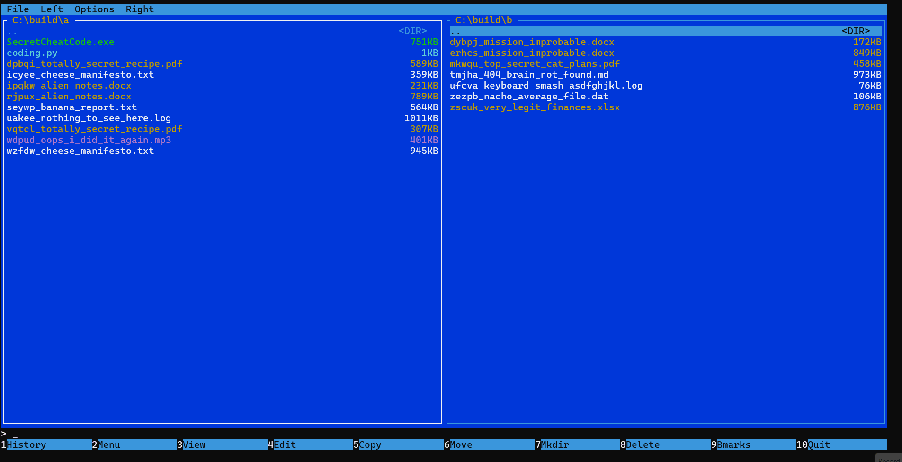

# philcom (Phil Commander)

A lightweight terminal file manager inspired by Midnight Commander, Total Commander, Far Manager. Built with Rust and [Ratatui](https://github.com/ratatui/ratatui).



## Features

- 4 themes — Dark, Light, Monokai, Nord — switchable at runtime
- Tabs — per-panel tabs, Ctrl+T/W to open/close, mouse-switchable
- File viewer (F3) — line numbers, wrap toggle, text selection, copy to clipboard
- Built-in editor (F4) — Ctrl+S save, clipboard support, unsaved-changes guard
- File operations — F5 Copy, F6 Move/Rename, F7 Mkdir, F8 Delete
- Batch operations — Space to mark files, then copy/move/delete all at once
- File search — wildcard, grep-in-files, and hex byte patterns; browsable results panel
- Command line — run shell commands, `cd` navigation, `q`/`quit`/`exit` to quit
- Directory history & bookmarks — Alt+H history, Ctrl+D to bookmark, F9 to jump
- File type coloring & executable filter — colour-coded by extension/magic bytes; filter to executables only
- Configurable function-key buttons via TOML
- Cross-platform — macOS, Linux, Windows

## Installation

```bash
git clone https://github.com/arkup/philcom.git
cd philcom
cargo build --release
./target/release/philcom
```

Or install globally (makes `philcom` available anywhere in your terminal):

```bash
cargo install --path .
```

To uninstall:

```bash
cargo uninstall philcom
rm -rf ~/.config/philcom
```

## Usage

```bash
philcom                                 # both panels → current directory
philcom /tmp                            # left → /tmp, right → current directory
philcom /tmp ~/projects                 # positional: left then right
philcom --left /tmp --right ~/projects  # named flags
philcom -l /tmp -r ~/projects           # short flags
philcom --left /tmp                     # only left specified
philcom -h                              # show help
```

## Keyboard Shortcuts

### Navigation

| Key | Action |
|-----|--------|
| `↑` / `↓` | Move selection up / down |
| `PgUp` / `PgDn` | Scroll 10 items |
| `Enter` | Open directory |
| `Esc` | Go back (folder history) |
| `Tab` / `←` / `→` | Switch active panel |
| `Space` | Mark / unmark file |
| `Ctrl+←` / `Ctrl+→` | Resize panels (5% steps) |
| `g` | Go to path dialog |
| `/` | Quick filter (type to filter panel, Esc to clear) |
| `Ctrl+S` | Cycle sort: Name → Size → Date → Ext (repeating reverses direction) |

### File Operations

| Key | Action |
|-----|--------|
| `F3` | View file |
| `F4` | Edit file (built-in editor) |
| `F5` | Copy to other panel |
| `F6` | Move / Rename |
| `F7` | Create directory |
| `F8` | Delete (with confirmation) |
| `F9` | Bookmarks — open bookmark list |
| `Ctrl+D` | Bookmark current directory |

### Command Line

| Input | Action |
|-------|--------|
| Any command + `Enter` | Run shell command |
| `cd <path>` | Navigate active panel to path |
| `cd <dir/file>` | Navigate to dir, select file |
| `cd` | Go to home directory |
| `q` / `quit` / `exit` | Quit philcom |

### Tabs

| Key | Action |
|-----|--------|
| `Ctrl+T` | New tab (clone current directory) |
| `Ctrl+W` | Close current tab |
| `Ctrl+PgDn` | Next tab |
| `Ctrl+PgUp` | Previous tab |

Tabs can also be managed via the **Left / Right** panel menu. Click a tab label in the panel border to switch to it.

### Interface

| Key | Action |
|-----|--------|
| `F2` | Toggle menu bar |
| `Alt+F1` | Drive / mount list for left panel |
| `Alt+F2` | Drive / mount list for right panel |
| `Ctrl+O` | Spawn interactive shell (`exit` or `Ctrl+D` to return) |
| `Alt+H` | Directory history popup |
| `Alt+L` | Operation log popup |
| `F10` / `Ctrl+C` | Quit |

## Configuration

Config is stored at `~/.config/philcom/config.toml` and is created automatically on first run with defaults.

```toml
theme = "dark"   # dark | light | monokai | nord

[[buttons]]
key = 1
label = "Help"
command = "help"

[[buttons]]
key = 5
label = "Copy"
command = "copy"

# ... etc
```

## License

MIT License

Copyright (c) 2026 arkup

Permission is hereby granted, free of charge, to any person obtaining a copy
of this software and associated documentation files (the "Software"), to deal
in the Software without restriction, including without limitation the rights
to use, copy, modify, merge, publish, distribute, sublicense, and/or sell
copies of the Software, and to permit persons to whom the Software is
furnished to do so, subject to the following conditions:

The above copyright notice and this permission notice shall be included in all
copies or substantial portions of the Software.

THE SOFTWARE IS PROVIDED "AS IS", WITHOUT WARRANTY OF ANY KIND, EXPRESS OR
IMPLIED, INCLUDING BUT NOT LIMITED TO THE WARRANTIES OF MERCHANTABILITY,
FITNESS FOR A PARTICULAR PURPOSE AND NONINFRINGEMENT. IN NO EVENT SHALL THE
AUTHORS OR COPYRIGHT HOLDERS BE LIABLE FOR ANY CLAIM, DAMAGES OR OTHER
LIABILITY, WHETHER IN AN ACTION OF CONTRACT, TORT OR OTHERWISE, ARISING FROM,
OUT OF OR IN CONNECTION WITH THE SOFTWARE OR THE USE OR OTHER DEALINGS IN THE
SOFTWARE.
